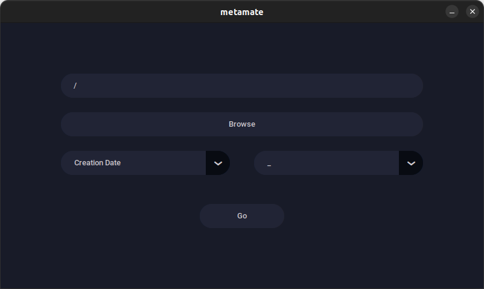
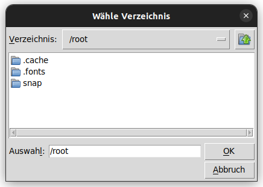

# metamate

metamate is a powerful tool for batch renaming files in a directory based on various criteria. It offers a flexible and efficient solution for managing large numbers of files, whether you need to organize photos, music files, or documents.

## Features

- Customizable renaming criteria: choose from a variety of tags to rename files based on their metadata, including file creation date, file modification date, file size, and more
- Customizable separator: choose the character to separate the file name and tag in the renamed file
- Simple and intuitive user interface: the program's interface is designed to be easy to use, even for users with little technical expertise
- Batch renaming: rename multiple files at once, saving you time and effort
- Cross-platform compatibility: metamate is written in Python and runs on any platform with Python installed, including Windows, macOS, and Linux

## Installation

1. Download the metamate repository and extract it on your computer
2. Open a terminal window and navigate to the extracted metamate directory
3. Install the required packages by running the following command: `pip install -r requirements.txt`
4. Run the program by entering `python3 metamate.py` into the terminal

or visit the [download page](https://fabianjuelich.xyz/metamate) to download the Windows installer

## Usage

1. Enter or select the path of the folder containing the files you want to rename
2. Select a renaming criterion from the "Tag" dropdown menu
3. Select a separator from the "Separator" dropdown menu
4. Click the "Go" button to rename the files in the specified directory

## Screenshots

## Credits

- https://github.com/TomSchimansky/CustomTkinter
- https://icons8.com